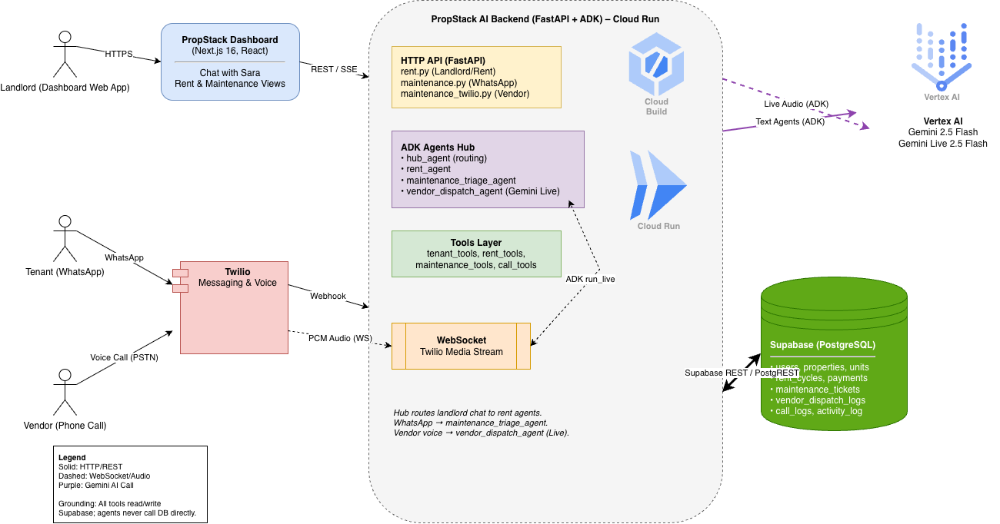
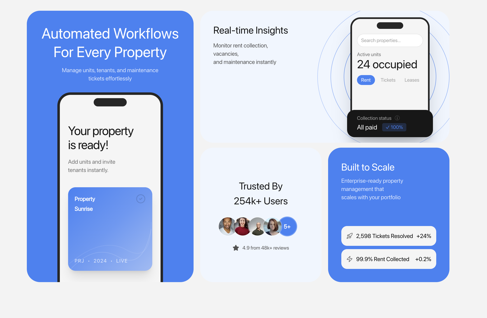
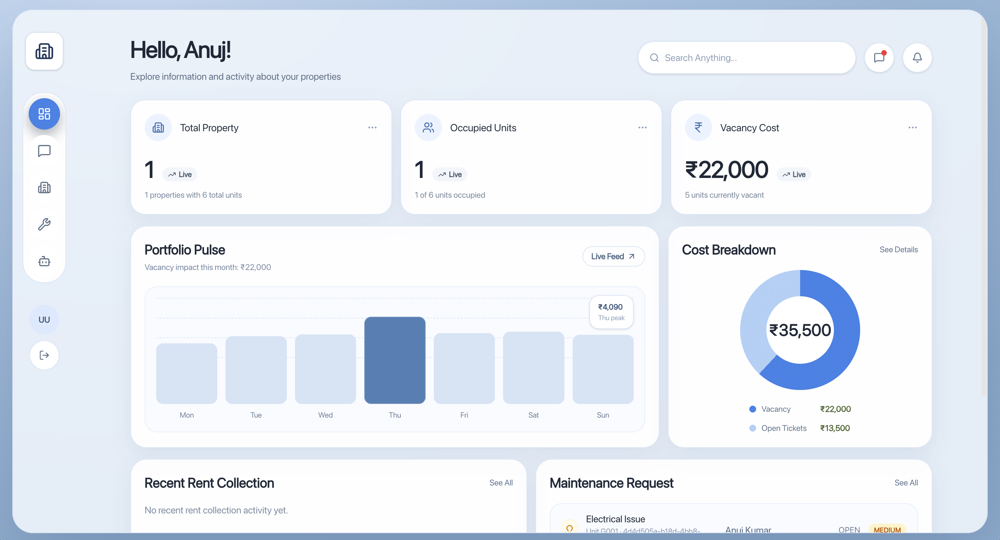
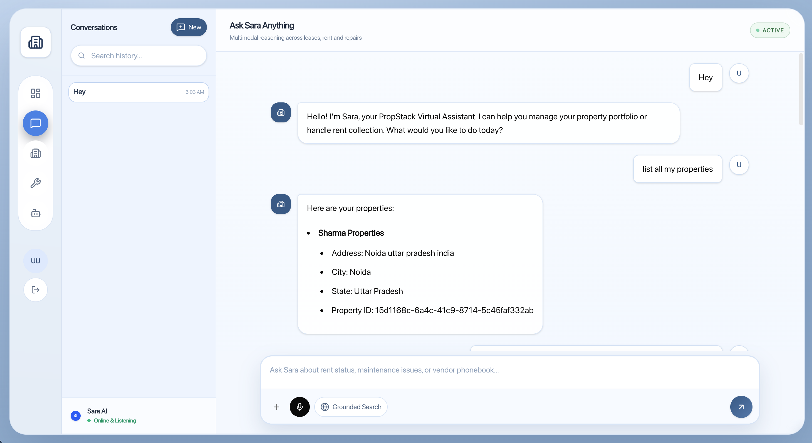
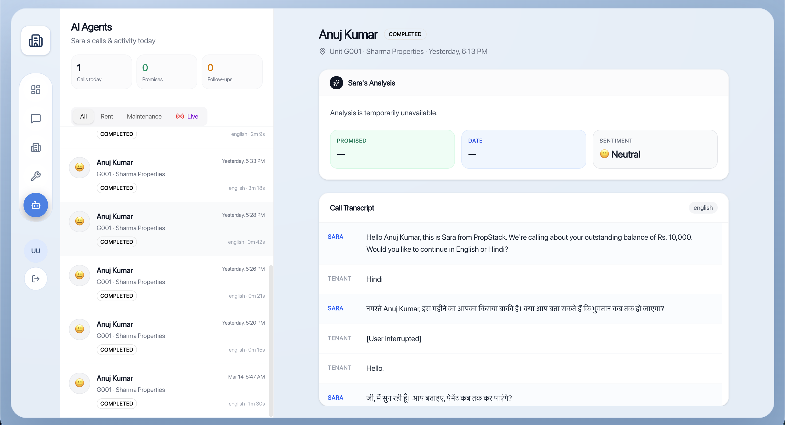
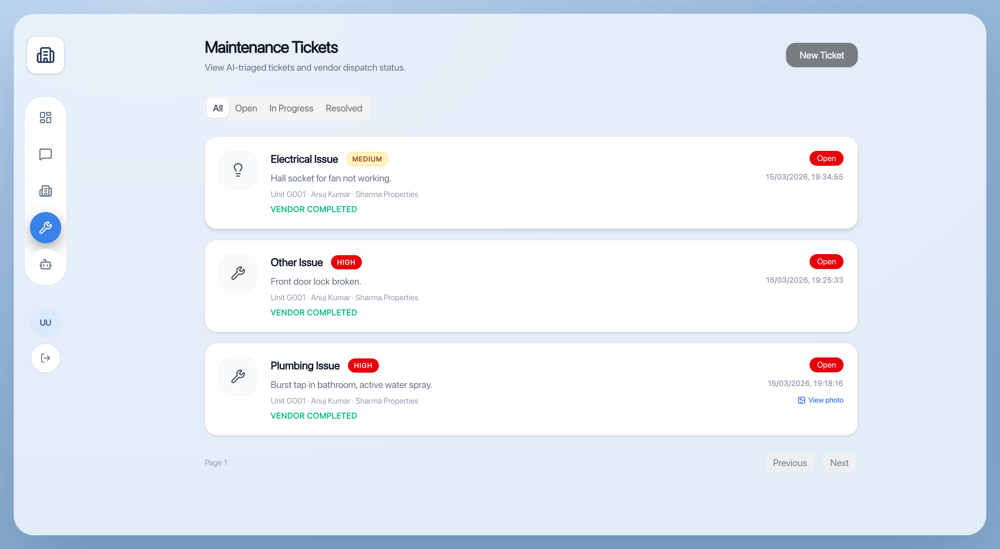
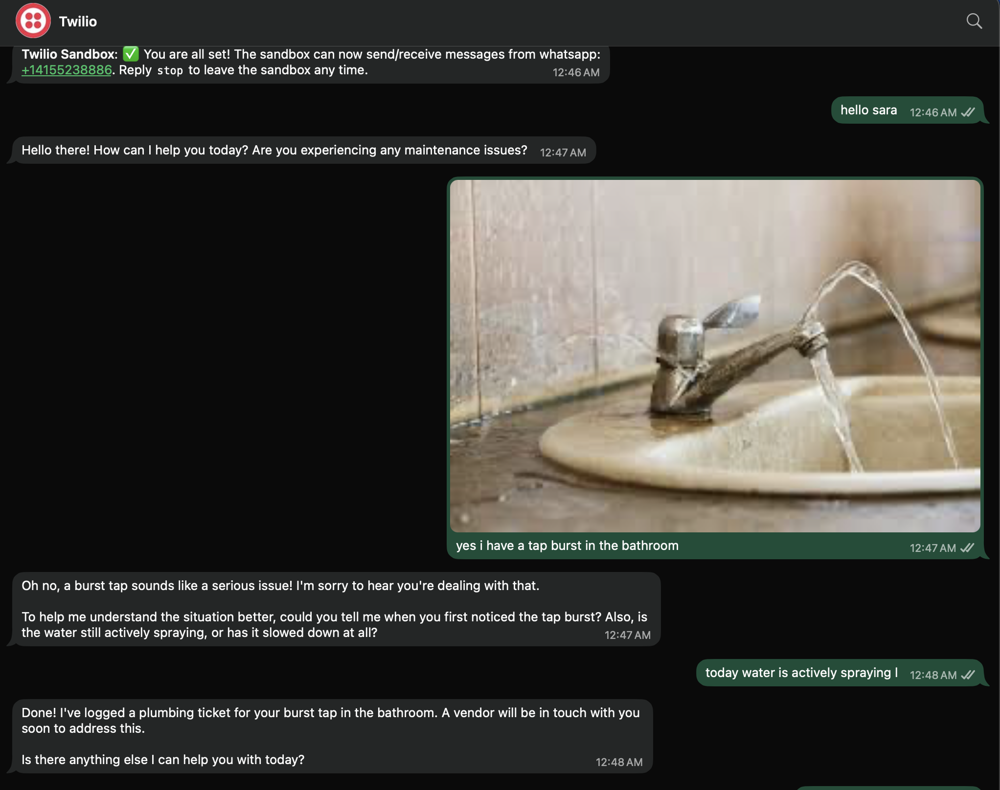

# PropStack – Live AI Rent & Maintenance Agent

**PropStack** is an AI-powered property management platform that gives small landlords their own "AI operations team" — a live rent collection agent and a maintenance triage + vendor dispatch assistant that talk to tenants and vendors over voice and WhatsApp, grounded on real data in Supabase and deployed on Google Cloud Run with Gemini + ADK.

This is our submission to the **Gemini Live Agent Challenge** in the **Live Agents** category.

---

## Problem & Vision

Independent landlords juggle three painful jobs:

1. **Rent collection** – chasing late payments, logging calls, tracking promises
2. **Maintenance triage** – turning vague WhatsApp messages like "water problem" into structured tickets
3. **Vendor dispatch** – calling plumbers/electricians, explaining issues, negotiating availability

These are all repetitive, time-sensitive conversations that don't belong in dashboards — they belong in your phone and WhatsApp, handled by a smart, interruption-safe agent that's grounded in your actual portfolio data.

**Our vision:** a live, multimodal "property operations team":

- **Sara**, the rent collection agent, who talks to tenants, calls them, and keeps the dashboard consistent
- A maintenance agent that understands tenant messages on WhatsApp, creates structured tickets, and then calls vendors live to accept jobs

---

## What We Built

PropStack is an end-to-end system with:

### Frontend (propstack-frontend)

- **Next.js 16** dashboard (App Router)
- Landlords manage properties, units, tenants, maintenance tickets, and chat with Sara
- Modern UI with Tailwind CSS v4 + Shadcn components

### Backend (propstack-ai)

- **Python FastAPI** + **Google ADK**
- ADK agents for:
  - Rent collection (chat + Twilio voice)
  - Maintenance triage (WhatsApp)
  - Vendor dispatch (Twilio voice + Gemini Live)
- Tool layer over Supabase (PostgreSQL) and Twilio

### Database

- **Supabase** (PostgreSQL) with schema for:
  - `users`, `properties`, `units`, `tenancies`
  - `rent_cycles`, `payments`
  - `maintenance_tickets`, `ticket_images`, `activity_log`
  - `call_logs`, `vendor_dispatch_logs`
  - `notifications`

### AI / Voice

- **Gemini 2.5 Flash** via ADK/Vertex AI for text agents
- **Gemini Live 2.5 Flash Native Audio** for voice agents
- **Twilio** for WhatsApp + Voice

---

## Why This Breaks the Text Box

This project intentionally goes beyond "chatbot in a div":

### 1. Live Voice to Vendors (Gemini Live + Twilio Media Streams)

- Bi-directional WebSocket bridge from Twilio Media Streams to ADK `run_live`
- Vendors can interrupt, ask questions, and the agent adapts in real-time
- Agent has structured context: ticket category, severity, unit number, property name, and address

### 2. WhatsApp Maintenance Triage

- Tenants send natural WhatsApp messages (text + optional images)
- Agent triages with a multi-phase protocol (acknowledge → ask clarifying questions → create structured ticket)
- Images fetched and passed to Gemini

### 3. Dashboard Chat with Sara

- Live, streaming text chat (Server-Sent Events)
- Agents use tools for all data fetches — no hallucinated SQL
- Hub agent routes between rent collection and property management

### 4. Persona & UX

- Sara has a consistent persona in voice and text
- Voice agents are short, interruption-safe, bilingual (English/Hindi)
- Optimized for phone-call dynamics, not essays

---

## Architecture

**System overview:** how the Next.js dashboard, Twilio (WhatsApp + Voice), FastAPI + ADK agents (Cloud Run), Vertex AI (Gemini + Gemini Live), and Supabase work together.



**Tip:** Place the architecture image at `propstack-ai/assets/architecture/Architecture.png` so it renders on GitHub/Devpost.

---

## Product Screenshots

### Architecture (High-Level)

This diagram is the “big picture” for judges: where Gemini Live runs, where data is grounded (Supabase), and how Twilio voice/WhatsApp connect to the agents.


### Landing Page

The landing page introduces PropStack and the “Sara” live agent experience for landlords.




### Dashboard (Landlord)

The dashboard shows portfolio insights (vacancy cost, open tickets, rent activity) and connects directly to the live agent workflows.




### Chat and Call with Sara (ADK Agents)

Landlords can chat with Sara for rent status, tenant lookup, and management actions (grounded in Supabase via tools).





### Maintenance Tickets with Twilio Whatsapp (ADK Agents)




```

| Component       | Technology                                            |
| --------------- | ----------------------------------------------------- |
| Frontend        | Next.js 16.1.6, React 19, TypeScript, Tailwind CSS v4 |
| Backend         | Python FastAPI, Google ADK                            |
| Database        | Supabase (PostgreSQL)                                 |
| AI              | Gemini 2.5 Flash, Gemini Live 2.5                     |
| Voice/Messaging | Twilio (Voice + WhatsApp)                             |
| Deployment      | Google Cloud Run                                      |
| Container       | Docker                                                |


---

## Key Agent Flows

### 1. Rent Collection (Chat + Voice)

```

Landlord → Dashboard Chat → hub_agent → rent_agent
↓
Tools: get_tenants_with_rent_status,
initiate_rent_collection_call
↓
Twilio → Tenant Call

```

### 2. Maintenance Triage (WhatsApp)

```

Tenant (WhatsApp) → Twilio Webhook → maintenance_triage_agent
↓
Tools: create_maintenance_ticket
↓
Landlord Dashboard (structured ticket)

```

### 3. Vendor Dispatch (Live Voice)

```

System Trigger → Find Vendor → Twilio Outbound
↓
vendor_dispatch_agent (Gemini Live)
↓
Tools: vendor_accepts_ticket / vendor_rejects_ticket
↓
Updates: maintenance_tickets, vendor_dispatch_logs

````

---

## Google Cloud & Gemini Usage

### Mandatory Tech Compliance

**Gemini Models:**

- Text agents: `gemini-2.5-flash` via ADK + Vertex AI
- Live voice: `gemini-live-2.5-flash-native-audio` via ADK `run_live` + Vertex AI

**ADK Usage:**

- All agents defined as `LlmAgent` with tools and instructions
- `Runner` with proper `RunConfig` (text + live)
- Session management via `SessionService`
- Tool guardrails via `before_tool_callback`

**Google Cloud Services:**

- Backend container deployed to **Google Cloud Run**
- Vertex AI for online text generation with tools
- Vertex AI Live API for streaming audio
- Configuration in `app/config.py`:

```python
GOOGLE_GENAI_USE_VERTEXAI=TRUE
GOOGLE_CLOUD_PROJECT=your-project-id
GOOGLE_CLOUD_LOCATION=us-central1
````

---

## Setup & Spin-Up Instructions

### Prerequisites

- Node.js (LTS) and pnpm
- Python 3.10+ and uv
- Supabase project
- Twilio account (Voice + WhatsApp)
- Google Cloud project with Vertex AI and Cloud Run enabled

### 1. Backend (propstack-ai)

```bash
cd propstack-ai

# Install dependencies
uv sync

# Create .env from .env.example with:
# - GOOGLE_GENAI_USE_VERTEXAI=TRUE
# - GOOGLE_CLOUD_PROJECT=your-gcp-project-id
# - GOOGLE_CLOUD_LOCATION=us-central1
# - SUPABASE_URL, SUPABASE_SERVICE_KEY, SUPABASE_DB_PASSWORD
# - TWILIO_ACCOUNT_SID, TWILIO_AUTH_TOKEN, TWILIO_VOICE_FROM_NUMBER
# - PUBLIC_BASE_URL=https://your-ngrok-or-cloudrun-url

# Run locally
uv run uvicorn app.main:app --reload --port 8001

# For local Twilio testing
ngrok http 8001
```

### 2. Frontend (propstack-frontend)

```bash
cd propstack-frontend
pnpm install
pnpm dev
```

### 3. Deploy to Google Cloud Run

```bash
# Build container
docker build -t gcr.io/your-project/propstack-ai -f propstack-ai/Dockerfile .

# Push to Container Registry
docker push gcr.io/your-project/propstack-ai

# Deploy to Cloud Run
gcloud run deploy propstack-ai \
  --image gcr.io/your-project/propstack-ai \
  --region us-central1 \
  --allow-unauthenticated \
  --set-env-vars=GOOGLE_GENAI_USE_VERTEXAI=TRUE,\
GOOGLE_CLOUD_PROJECT=your-project-id,\
GOOGLE_CLOUD_LOCATION=us-central1,\
SUPABASE_URL=...,\
SUPABASE_SERVICE_KEY=...,\
TWILIO_ACCOUNT_SID=...,\
TWILIO_AUTH_TOKEN=...
```

---

## Testing

### Unit Tests

```bash
cd propstack-ai
pytest
```

Test coverage:

- Tool functions (Supabase operations)
- Router endpoints
- Agent callbacks (guardrails, normalization)
- Call policy service
- Live session service

### Manual Testing Flows

1. **Dashboard Chat**: Ask Sara about rent status
2. **WhatsApp**: Send maintenance issues with/without images
3. **Vendor Calls**: Trigger dispatch, accept/reject as vendor

---

## Data, Grounding & Safety

### Data Grounding

- All operational decisions grounded in Supabase tables
- Agents explicitly instructed to use tools for all data access
- No hallucinated SQL or phone numbers
- Re-fetch data when user says "DB has been updated"

### Safety

- Call windows enforced (IST 09:00–20:00)
- Rate limits (max 2 calls/tenant/day)
- Tool layer validation before execution
- Error codes from ADK (SAFETY/BLOCKLIST) end calls gracefully

---

## Learnings

1. **ADK + Vertex AI is a great fit for complex agent workflows**

- `LlmAgent`, tools, and `Runner` enable multi-phase flows
- Business logic stays in Python

2. **Live voice changes prompt design**

- Response length: 1-2 sentences
- Interruption handling
- When to repeat location vs. detail

3. **Supabase + Twilio + Gemini = full-stack AI operations**

- Single Postgres schema
- Own entire journey: WhatsApp → ticket → vendor call → dashboard

---

## Future Work

- Richer call analytics (sentiment, outcome classification)
- Sophisticated vendor selection (skills, geofencing)
- Landlord configuration UI
- Deeper multimodal (vendor seeing ticket photos during call)

---

## Project Structure

```
propstack-main/
├── propstack-frontend/          # Next.js 16 frontend
│   ├── app/                    # App Router pages
│   ├── components/              # React components (Shadcn + custom)
│   └── lib/                    # Utilities, API clients
│
├── propstack-ai/               # Python FastAPI + ADK backend
│   ├── app/
│   │   ├── agents/            # ADK agents (hub, rent, management, maintenance)
│   │   ├── tools/            # Function tools (16 tools)
│   │   ├── routers/           # FastAPI routes
│   │   ├── services/         # Business logic
│   │   └── config.py         # Settings
│   └── tests/                 # pytest test suite
│
├── Dockerfile                  # Backend container
├── docker-compose.yml          # Local dev orchestration
└── README.md                   # This file
```

---

## Demo Video

[Watch the 4-minute demo video →](#) _(Add your video link)_

---

## Google Cloud Deployment Proof

See `propstack-ai/app/config.py` for Vertex AI configuration:

- `GOOGLE_GENAI_USE_VERTEXAI=TRUE`
- `GOOGLE_CLOUD_PROJECT`
- `GOOGLE_CLOUD_LOCATION`

Cloud Run deployment commands are documented in the Setup section above.

---

_Built with ❤️ for the Gemini Live Agent Challenge_
