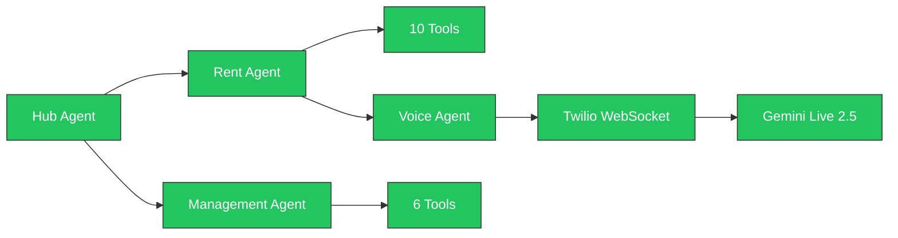

# PropStack — Hackathon Judging Review

## Overall Verdict

**PropStack is in a strong position.** You've built a genuinely multimodal, production-ready AI agent system that goes well beyond a text chatbot. Below is a detailed scorecard against each rubric, with what's strong, what's missing, and concrete improvement suggestions.

---

## 1. Innovation & Multimodal User Experience (40%)

### Current Score Estimate: **28–30 / 40** (Strong)

### ✅ What You Have (Strengths)

| Capability                         | Evidence                                                                                                                                                                                                           |
| ---------------------------------- | ------------------------------------------------------------------------------------------------------------------------------------------------------------------------------------------------------------------ |
| **Breaks the "text box" paradigm** | Sara makes real phone calls via Twilio → Gemini Live, not just chat                                                                                                                                                |
| **See, Hear, Speak**               | ✅ **Hear** (realtime voice input via Twilio media stream), ✅ **Speak** (Gemini Live native audio output streamed back to phone), ✅ **See** (dashboard for landlords to see rent status, call logs, transcripts) |
| **Distinct Persona**               | Sara has a consistent identity across hub, rent, management, and voice agents                                                                                                                                      |
| **Live & Context-Aware**           | Bidirectional WebSocket streaming (`run_live` + `LiveRequestQueue`), dynamic greeting with tenant name/rent/property, agent can use tools mid-call to answer tenant questions                                      |
| **Multilingual**                   | Hindi/English auto-detection and code-switching during voice calls                                                                                                                                                 |
| **Interruption Handling**          | `event.interrupted` is handled, transcript logs `[User interrupted]`                                                                                                                                               |

### ⚠️ What's Missing / Could Be Stronger

| Gap                                     | Impact                                                                       | Suggestion                                                                                                         |
| --------------------------------------- | ---------------------------------------------------------------------------- | ------------------------------------------------------------------------------------------------------------------ |
| **No image/document understanding**     | Missing the "See" modality (camera/vision) from judges' perspective          | Add receipt/screenshot upload for payment proof verification — let Sara analyze a photo of a bank transfer receipt |
| **No browser-side voice**               | Landlord UX is text-only on the dashboard; voice is only outbound to tenants | Add a "Talk to Sara" mic button in the dashboard using WebRTC + Gemini Live for landlords too                      |
| **No proactive/live dashboard updates** | Dashboard doesn't update when a call completes — user must refresh           | Add WebSocket push from backend → frontend for call status updates, notifications in real-time                     |
| **Persona voice is system prompt only** | Sara's personality exists as text instructions, not a custom TTS voice       | Consider using Gemini Live's voice config to set a consistent voice style/persona                                  |

---

## 2. Technical Implementation & Agent Architecture (30%)

### Current Score Estimate: **22–24 / 30** (Very Strong)

### ✅ What You Have (Strengths)

| Feature                      | Evidence                                                                                                                                                                                                                                                                                                     |
| ---------------------------- | ------------------------------------------------------------------------------------------------------------------------------------------------------------------------------------------------------------------------------------------------------------------------------------------------------------ |
| **ADK usage is exemplary**   | `LlmAgent`, `Runner`, `run_async`, `run_live`, `LiveRequestQueue`, `RunConfig`, `StreamingMode.BIDI`, `BuiltInPlanner` with `ThinkingConfig` — you're using nearly every major ADK feature                                                                                                                   |
| **Multi-agent architecture** | Hub agent dispatches to `rent_agent` and `management_agent` sub-agents — clean separation of concerns                                                                                                                                                                                                        |
| **Deterministic guardrails** | [before_tool_guardrail](file:///Users/anuj846k/Developer/Propstack-main/propstack-ai/app/agents/shared.py#27-107) enforces call windows (IST 09:00–20:00), rate limits (max 2/day), landlord-tenant ownership validation — all before the LLM can act                                                        |
| **Tool envelopes**           | Normalized `status/message/data/error_message` response format across all tools via [after_tool_normalizer](file:///Users/anuj846k/Developer/Propstack-main/propstack-ai/app/agents/shared.py#109-154)                                                                                                       |
| **Audio transcoding**        | Full mulaw↔PCM16 pipeline with sample rate conversion (8kHz↔16kHz↔24kHz)                                                                                                                                                                                                                                     |
| **Session management**       | ADK [SessionService](file:///Users/anuj846k/Developer/Propstack-main/propstack-ai/app/services/live_session_service.py#31-155) for chat persistence, [LiveSessionService](file:///Users/anuj846k/Developer/Propstack-main/propstack-ai/app/services/live_session_service.py#31-155) for voice call lifecycle |
| **Streaming chat**           | SSE streaming with word-chunking for natural typing effect                                                                                                                                                                                                                                                   |
| **Error handling**           | Consistent try/except → envelope pattern, Twilio signature validation, config validation                                                                                                                                                                                                                     |
| **Grounding**                | Agent queries live Supabase data (rent status, payment history, collection history) before answering — no static hallucinated data                                                                                                                                                                           |

### ⚠️ What's Missing / Could Be Stronger

| Gap                                                                                                          | Impact                                                                                                                                      | Suggestion                                                                                                                                                                                     |
| ------------------------------------------------------------------------------------------------------------ | ------------------------------------------------------------------------------------------------------------------------------------------- | ---------------------------------------------------------------------------------------------------------------------------------------------------------------------------------------------- |
| **No Google Cloud hosting evidence**                                                                         | Judging criteria asks: _"Is the backend robustly hosted on Google Cloud?"_                                                                  | Deploy to **Cloud Run** — the `mcp_cloudrun` tools can do this. This is a significant gap for scoring.                                                                                         |
| **No Vertex AI integration**                                                                                 | `google_genai_use_vertexai: bool = False` — you're using API key auth, not Vertex                                                           | Switch to Vertex AI for the demo. Judges will notice Google Cloud integration depth.                                                                                                           |
| **No explicit grounding with Google Search / RAG**                                                           | Tools query the DB, but there's no evidence of using Google Search grounding or retrieval to prevent hallucinations about general knowledge | Add `google_search` as a grounding tool (ADK supports this out-of-box) for questions Sara can't answer from DB                                                                                 |
| **No tests**                                                                                                 | Zero test files found — judges checking code quality will notice                                                                            | Add at least unit tests for `call_policy_service.evaluate_call_policy()` and [before_tool_guardrail](file:///Users/anuj846k/Developer/Propstack-main/propstack-ai/app/agents/shared.py#27-107) |
| **[rent.py](file:///Users/anuj846k/Developer/Propstack-main/propstack-ai/app/routers/rent.py) is 831 lines** | Code quality concern given your own 200-300 line rule                                                                                       | Already split Twilio into its own router — good. Consider splitting chat endpoints further.                                                                                                    |

---

## 3. Feature-Level Status Summary

| Feature                                 | Status     | Notes                                                                                                                   |
| --------------------------------------- | ---------- | ----------------------------------------------------------------------------------------------------------------------- |
| Multi-agent dispatch (Hub → sub-agents) | ✅ Done    | Clean LlmAgent hierarchy                                                                                                |
| Text chat with SSE streaming            | ✅ Done    | With context stripping, session persistence                                                                             |
| Outbound voice calls via Twilio         | ✅ Done    | Full lifecycle: initiate → TwiML → media stream → callback                                                              |
| Gemini Live bidirectional audio         | ✅ Done    | `run_live` + `LiveRequestQueue` + audio transcoding                                                                     |
| Multilingual Hindi/English voice        | ✅ Done    | Auto-detection in voice agent instructions                                                                              |
| Deterministic call guardrails           | ✅ Done    | Time window, rate limiting, ownership validation                                                                        |
| Tool-grounded responses (DB queries)    | ✅ Done    | 16 tools total querying live Supabase data                                                                              |
| Transcript collection & logging         | ✅ Done    | JSON format with dedup, interruption tracking                                                                           |
| Payment webhook (Razorpay)              | ✅ Done    | Webhook endpoint in [payments.py](file:///Users/anuj846k/Developer/Propstack-main/propstack-ai/app/routers/payments.py) |
| Rent sweep scheduler                    | ✅ Done    | Automated sweep with dry-run support                                                                                    |
| Dashboard UI                            | ✅ Done    | Properties, tenants, chat, call history                                                                                 |
| Cloud Run deployment                    | ❌ Missing | **High priority** for judging                                                                                           |
| Image/Vision modality                   | ❌ Missing | Would strengthen "See" criterion                                                                                        |
| Browser voice for landlords             | ❌ Missing | Would strengthen "seamless experience"                                                                                  |
| Google Search grounding                 | ❌ Missing | Would strengthen "avoid hallucinations"                                                                                 |
| Automated tests                         | ❌ Missing | Code quality signal                                                                                                     |

---

## 4. Priority Recommendations (Biggest Score Impact)

### 🔴 Critical (Do These First)

1. **Deploy to Google Cloud Run** — This directly addresses _"robustly hosted on Google Cloud"_. Use `mcp_cloudrun_deploy_local_folder` to deploy the FastAPI backend. Takes ~10 minutes.

2. **Add Google Search Grounding** — ADK has built-in `google_search` tool support. Add it to the hub agent so Sara can answer general property management questions without hallucinating.

### 🟡 High Impact (If Time Permits)

3. **Add browser-side voice** — You already have the `/live/browser/{session_id}` WebSocket stub in `rent.py:796`. Wire it up with a mic button on the frontend to let landlords talk to Sara directly.

4. **Add image upload for payment proof** — Let tenants or landlords upload a screenshot of a bank transfer. Use Gemini's vision capabilities to extract amount/date and match against rent records.

### 🟢 Nice to Have

5. **Real-time dashboard updates** — Push call completion events via WebSocket to the frontend.
6. **Unit tests** for guardrails and call policy logic.
7. **Custom voice persona** for Sara using Gemini Live voice configuration.

---

## 5. Bottom Line

| Criterion                    | Weight  | Your Score | Max    |
| ---------------------------- | ------- | ---------- | ------ |
| Innovation & Multimodal UX   | 40%     | ~29        | 40     |
| Technical Implementation     | 30%     | ~23        | 30     |
| **Weighted Total (these 2)** | **70%** | **~52**    | **70** |

> [!IMPORTANT]
> Your **biggest gap is Cloud Run deployment** — it's the single most impactful thing you can do because it directly maps to a judging criterion ("robustly hosted on Google Cloud"). The agent architecture and multimodal voice pipeline are genuinely impressive and well above average for a hackathon project. The Twilio ↔ ADK Live ↔ Gemini pipeline with bidirectional audio, interruption handling, and multilingual support is a standout feature.
